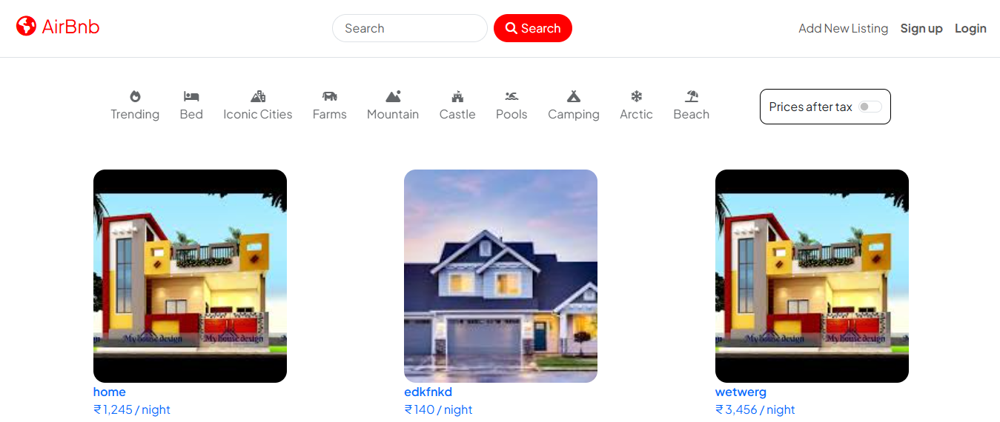
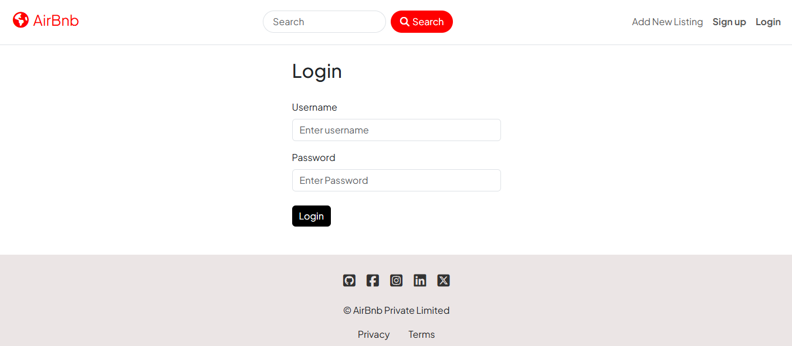
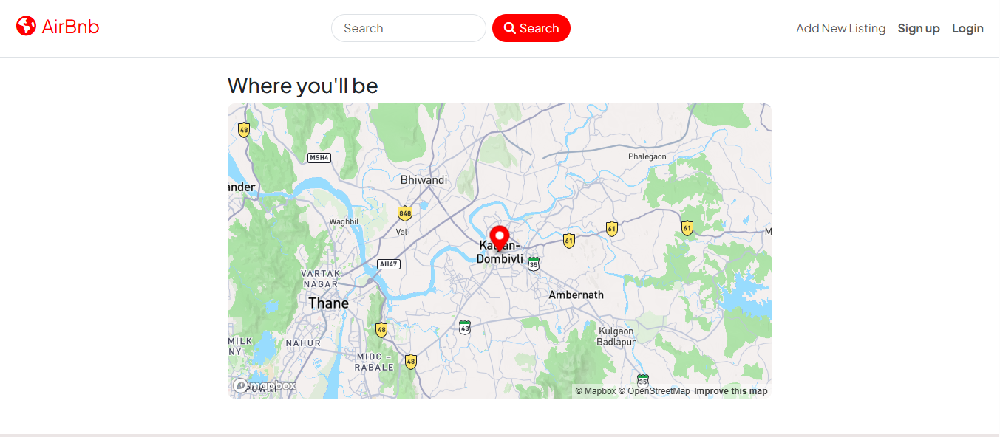
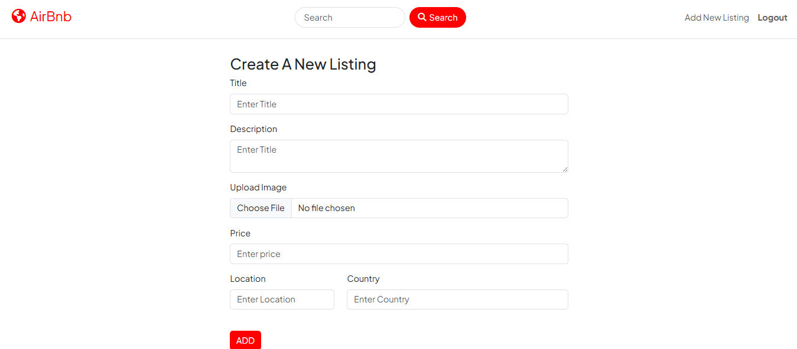
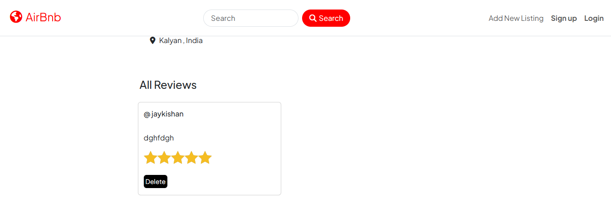
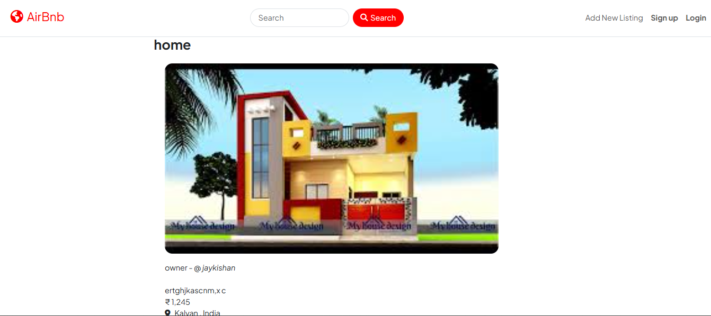
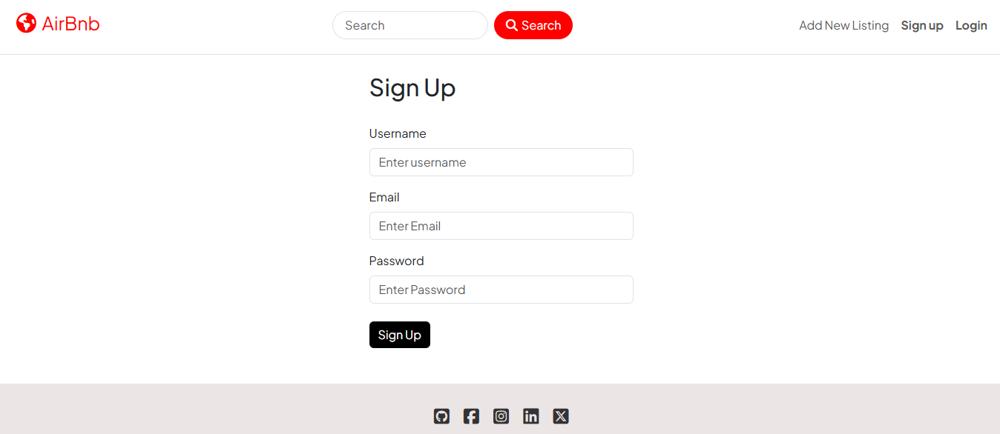

# AIRBNB WEBSITE FULL STACK CLONE

## DESCRIPTION
A fully functional Airbnb clone that lets users create, edit, and manage property listings, leave and view reviews, and browse available stays through an interactive map interface. Designed with a clean UI and a focus on user experience.

## TECH STACK USED

### Frontend
- HTML
- CSS
- JavaScript
- EJS

### Backend
- NodeJS
- ExpressJS

### DataBase
- MongoDB

## SCREENSHOTS

### 🏠 Home Page

---

### 🔐 Login Page

---

### 🗺️ Map View

---

### ➕ Add New Listing

---

### 📝 Reviews Section

---

### 📄 Show Listing Page

---

### 🧾 Signup Page

